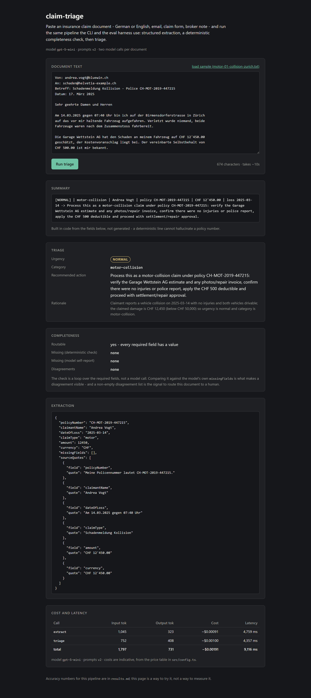

# claim-triage

[](https://github.com/MichaelMoeckli/insurance-doc-triage/actions/workflows/ci.yml)

Structured extraction and triage of unstructured Swiss insurance and finance documents,
using OpenAI Structured Outputs — with an eval harness that makes prompt changes
measurable instead of anecdotal.

25 synthetic documents. Two model calls per document. One report.

## At a glance

|  |  |
| --- | --- |
| **The task** | A claim notification arrives as free text in German or English. Pull out the policy number, claimant, date of loss and amount; flag what the document *fails* to say; decide how fast a human must pick it up. |
| **Headline** | **99.3%** field accuracy (149/150) and **100%** urgency accuracy with zero under-triage, on `gpt-5-mini`, at ~$0.002 and ~10s per document. |
| **The caveat, up front** | Most of the v1 → v2 delta is **noise**, and the run proves it — four metrics moved that a one-string prompt change cannot touch. At 25 documents one flipped answer is 0.67pp. [The analysis is the deliverable, not the number.](#an-honest-caveat-on-these-numbers) |
| **What's interesting** | The eval harness was built *before* the prompt was tuned, so v2 could be shown to have fixed its target, introduced an equal regression, and left the rest to chance — which turned a prompt question into a [data-modelling one](#what-v2-actually-did). |
| **Model choice** | **The frontier model is the wrong buy.** Same prompt on `gpt-5`: 6.4× the cost, zero accuracy gained. On `gpt-4.1-mini`: half the price, and it under-triages two injuries and a legal deadline. [Why the middle model wins.](#what-the-model-comparison-found) |
| **Stack** | TypeScript, OpenAI Responses API with strict Structured Outputs, hand-written JSON Schemas, a versioned prompt registry, and a one-page Next.js demo over the same pipeline. |
| **Check it in 30 seconds** | `npm install && npm run eval:validate` — validates all 25 document/label pairs. No API key, no model calls, no spend. |

**Start here if you're skimming:** [Results](#results) · [What v2 actually did](#what-v2-actually-did) · [The honest caveat on these numbers](#an-honest-caveat-on-these-numbers) · [What I'd send back to product and research](#what-id-send-back-to-product-and-research)



<sub>`npm run web` — the same `runPipeline` the CLI and the eval harness call, with per-call
tokens, cost and latency. Setup in [Try it in a browser](#try-it-in-a-browser).</sub>

---

## Problem

A Swiss composite insurer receives claim notifications as unstructured text: customer
emails in German and English, transcribed paper claim forms, broker notes, adjuster
memos, hospital invoice cover letters, phone-call notes. Before anything else can happen,
a human reads each one and does three small things: pulls out the policy number, the
claimant, the date of loss and the amount; notices what the document *fails* to say, so
the missing information can be requested in the first reply rather than the fourth; and
decides how fast it needs to be picked up.

That work is high-volume, low-judgement, and it is the bottleneck in front of everything
downstream. It is also where the cost sits: a claim that waits in a queue because nobody
noticed the water was still running is more expensive than the same claim handled on the
day it arrived, and a claim that bounces back and forth for three weeks because the first
reply asked for the wrong missing field is expensive in handler time.

This repository is the narrow first slice of that: **extract, flag what's missing,
triage** — with the measurement built in from the start.

## Approach

**Scope one narrow, high-value task and make it measurable before making it bigger.**

The temptation with a document pipeline is to build the whole thing — ingestion, OCR,
retrieval over policy wordings, a review UI — and then discover at the end that field
accuracy is 71% and nobody knows which part is responsible. So the order here is
deliberately inverted:

1. **Pick the narrowest task with real value.** Extraction plus triage on plain text. No
   OCR, no retrieval, no workflow integration. If this does not work, nothing built on
   top of it works either.
2. **Constrain the output before prompting for it.** Every model call uses Structured
   Outputs with a hand-written strict JSON Schema, so "the model returned prose instead
   of JSON" is not one of the failure modes that has to be handled, and the closed enums
   make classification measurable at all.
3. **Build the eval harness second, not last.** 25 labelled documents, a failure
   taxonomy, and a versioned prompt registry. The harness existed before the prompt was
   tuned, which is the only ordering that lets you claim a change was an improvement.
4. **Use the model only where a model is needed.** Completeness checking is a loop over a
   constant, not a third API call. The one-line summary is built with string
   concatenation, not generated. Both decisions remove latency, cost and a failure mode.

Three explicit rules make the numbers mean something:

- **The ambiguity rule.** If a field cannot be resolved to a single unambiguous value, it
  is `null` *and* its name goes in `missingFields`. "Letzten Dienstag" and "March 2025"
  are not dates. This is stated in the prompt, enforced in the ground-truth labels by the
  dataset validator, and enforced again at scoring time — `normalizeDate` refuses to
  rescue a month-only value.
- **The urgency rubric** (below) is fixed text, mirrored between the prompt and the
  labelling. If the rubric and the labels can drift, urgency accuracy measures nothing.
- **Strict and normalised accuracy are both reported.** Normalising away a date written
  with dots is fair. Silently hiding that it happened is not.

## The synthetic dataset

25 documents in `data/docs/`, each with a hand-authored label in `data/labels/`. The
distribution *is* the test design — the set is built to break the pipeline in specific,
diagnosable ways rather than to look representative:

| Dimension | Mix |
| --- | --- |
| Line of business | motor 7, property 7, health 6, liability 5 |
| Language | German 11, English 11, mixed German/English 3 |
| Format | emails, transcribed claim forms, broker notes, adjuster memos, a hospital invoice cover letter, a phone-call note, a lawyer's letter |
| Completeness | 13 complete, 12 with at least one unresolvable required field |
| Unresolvable dates | 5 — relative (`letzten Dienstag`), month-only (`im März 2025`, `Anfang Juni`), and format-ambiguous (`03/04/2025`, `06/07/2025`) |
| Number/currency traps | Swiss apostrophe (`12'450.00`), German decimal comma (`8.500,00`), rappen dash (`Fr. 3'200.—`), a euro amount on a Swiss policy, an amount with no currency stated |
| Urgency | high 7, normal 13, low 5 |
| Identifier distractors | claim references, invoice numbers, police report numbers, a law-firm file reference |
| Name distractors | brokers, adjusters, lawyers, an injured third party, and an HR contact sharing a surname with the injured employee |

Each label carries a `notes` line explaining *why* that document is hard. Those notes are
not scored — they are printed in the failure log, which turns it from a diff dump into
something readable.

## Architecture

```
data/docs/*.txt                                       data/labels/*.json
   (unstructured document)                              (ground truth)
        |                                                     |
        v                                                     |
  +-----------------+                                         |
  | 1. EXTRACT      |  OpenAI Responses API                   |
  |    model call   |  strict JSON Schema: extraction_result  |
  +-----------------+                                         |
        |  policyNumber, claimantName, dateOfLoss,            |
        |  claimType, amount, currency, missingFields         |
        v                                                     |
  +-----------------+                                         |
  | 2. COMPLETENESS |  deterministic - no model call          |
  |    plain TS     |  required fields + agreement check      |
  +-----------------+                                         |
        |  missing[], isComplete, disagreements[]             |
        v                                                     |
  +-----------------+                                         |
  | 3. TRIAGE       |  OpenAI Responses API                   |
  |    model call   |  strict JSON Schema: triage_result      |
  +-----------------+                                         |
        |  urgency, category, recommendedAction               |
        v                                                     |
  +-----------------+                                         |
  | 4. OUTPUT       |  JSON + one-line summary (built in TS)  |
  +-----------------+                                         |
        |                                                     |
        +--------------------> [ EVAL ] <---------------------+
                                  |
              results.md + results/run-<version>--<model>.json
```

Triage is a second call rather than a bigger schema on the first one. It costs roughly
double, and buys two things: triage reasons over *validated* fields and the completeness
flags instead of re-deriving them from raw text, and — more importantly — the eval can
tell an extraction error apart from a classification error. In a combined call, a
misparsed amount that drags urgency down the rubric shows up as two failures with one
cause, and the failure log stops pointing at the fix.

### Layout

```
src/
  schema.ts             strict JSON Schemas + runtime validators
  types.ts              domain types and closed vocabularies
  config.ts             env, paths, indicative pricing
  openai/client.ts      Responses API wrapper, model-aware parameters
  prompts/              versioned prompt registry (v1, + your v2)
  pipeline/             extract -> completeness -> triage -> summary
  eval/                 dataset loading, normalization, scoring, taxonomy, report
  cli/                  extract.ts (one document), eval.ts (the whole set), report.ts
app/                    one-page Next.js demo; a thin shell over the same pipeline
data/docs/              25 synthetic documents
data/labels/            25 ground-truth labels
results/                run records, one per (prompt version, model), committed -
                        they drive the comparison table
```

## How to run

Requires Node 20.11+ and an OpenAI API key.

```bash
npm install
```

```bash
cp .env.example .env
```

Add your key to `.env`, then:

```bash
npm run eval
```

Other entry points:

```bash
npm run eval:validate
```

Checks all 25 document/label pairs offline — pairing, enums, and the ambiguity rule — with
no API calls and no spend. Worth running first.

```bash
npm run eval:smoke
```

The first 5 documents only, as a cheap check that the key and model work.

```bash
npm run extract -- data/docs/motor-04-highway-injury.txt
```

One document, printing the summary line and the full JSON.

```bash
npx tsx src/cli/eval.ts --doc motor-04 --concurrency 8
```

Any other flag combination. `--doc` matches on an id substring; `npx tsx src/cli/eval.ts --help`
lists the rest.

> **On flags and `npm run`.** `npm run eval -- --limit 5` does not work: npm treats a
> `--flag` after the `--` separator as one of its own config keys and forwards only the
> value, so the script receives a bare `5`. It bites on Windows and PowerShell in
> particular. Positional arguments survive — which is why `npm run extract -- <path>` is
> fine — but flags need `npx tsx`, or one of the `eval:*` scripts above. The eval CLI
> detects the mangled form and says so rather than just rejecting the argument.

```bash
npm run report
```

Regenerates `results.md` from the run records already in `results/`. No API calls, no
spend — for when the report *renderer* changed and the report needs to catch up. Re-running
a paid eval to pick up a formatting change would also silently replace the measurements
this README analyses. `--version` and `--model` pick which run the report treats as
current; every record on disk appears in the comparison table regardless.

```bash
npm test
```

Unit tests for the normalization and scoring logic, on Node's built-in test runner. The
harness decides what counts as correct, so it gets tested.

### Try it in a browser

```bash
npm run web
```

Then open <http://localhost:3000>. Paste a document — or press *load sample* — and the page
shows the extracted JSON, the completeness flags, the triage, the one-line summary, and the
tokens, cost and latency of each of the two model calls. It reads the same `.env`, so it
runs whatever `OPENAI_MODEL` and `PROMPT_VERSION` are set to, and no separate configuration
is involved.

It is one route (`app/page.tsx`) and one API handler (`app/api/triage/route.ts`), and the
handler is a thin adapter: it validates the request, calls `runPipeline` — the same function
the CLI and the eval harness call — and returns the result. No auth, no database, no state,
no styling framework. If the page contained any triage logic of its own, it would be
demonstrating something the eval numbers do not cover.

`npm run web:build` and `npm run web:start` produce and serve a production build.
`npm run typecheck:web` typechecks the page against `tsconfig.web.json`, which is separate
from the Node-side `tsconfig.json` for reasons documented in `next.config.mjs` — along with
why the `web:*` scripts pass `--webpack`.

### Configuration

| Variable | Default | Notes |
| --- | --- | --- |
| `OPENAI_API_KEY` | — | Required, except for `--validate-only`. |
| `OPENAI_MODEL` | `gpt-5-mini` | Any Structured-Outputs-capable model. One of the two eval axes. |
| `OPENAI_REASONING_EFFORT` | `low` | gpt-5 / o-series only. |
| `PROMPT_VERSION` | `v1` | Selects the prompt set. The other eval axis. |

All four can be set in `.env`, which is the portable way to switch prompt versions on
Windows — `PROMPT_VERSION=v2 npm run eval` is POSIX shell syntax and will not work in
PowerShell. The CLIs, the eval harness and the browser page all read that one file; Next.js
loads `.env` from the project root by itself, so there is nothing extra to configure.

`src/openai/client.ts` branches on the model id: gpt-5 and o-series models get
`reasoning.effort`, everything else gets `temperature: 0`. Switching `OPENAI_MODEL` to
`gpt-4.1-mini` works without touching code.

## The urgency rubric

Mirrored verbatim in `src/prompts/v1.ts` and used to author every label.

- **high** — any of: a person was injured; damage is ongoing or the property is unsafe;
  a third party has set a legal or regulatory deadline; the claimed amount is CHF 50,000
  or more.
- **low** — all of: no injury, no ongoing damage, no deadline, and either the claimed
  amount is under CHF 1,000 or the document is purely administrative.
- **normal** — everything else.

`high` beats `low` when both apply. Missing fields do not raise urgency; they go in
`recommendedAction`.

In a real deployment these thresholds are the customer's to set, and the first discovery
session would replace them. They are written down here so that "urgency accuracy: 84%" is
a statement about something.

## Results

`gpt-5-mini`, 25 documents, 50 calls, ~42k in / ~19k out tokens, ~$0.05 per run.
Full tables, the failure log and the version comparison are in
[`results.md`](results.md); this is the summary.

| Metric | v1 | v2 |
| --- | --- | --- |
| Field accuracy (normalised) | 98.0% (147/150) | **99.3%** (149/150) |
| Field accuracy (strict) | 98.0% (147/150) | **98.7%** (148/150) |
| `policyNumber` | 100.0% (25/25) | 100.0% (25/25) |
| `claimantName` | 96.0% (24/25) | 96.0% (24/25) |
| `dateOfLoss` | 96.0% (24/25) | 100.0% (25/25) |
| `claimType` | 100.0% (25/25) | 100.0% (25/25) |
| `amount` | 96.0% (24/25) | 100.0% (25/25) |
| `currency` | 100.0% (25/25) | 100.0% (25/25) |
| `missingFields` exact set match | 92.0% (23/25) | 100.0% (25/25) |
| — precision / recall | 90.0% / 100.0% | 100.0% / 100.0% |
| Urgency accuracy | 100.0% (25/25) | 100.0% (25/25) |
| — of which under-triaged | 0 | 0 |
| Category accuracy | 100.0% (25/25) | 96.0% (24/25) |
| Hard failures | 5 | 2 |

**v2 change:** one string — the `claimantName` schema description. v1 called the field
*"the policyholder or claimant"*; v2 defines it as the policyholder explicitly. Both
instruction blocks, both input builders and every other field description are v1 verbatim
(`src/prompts/v2.ts` spreads `v1` rather than copying it, so the diff cannot drift).

**What it fixed / what it cost: net zero, and that is the finding.** Headline field
accuracy rose 1.3pp — and essentially none of that is attributable to the change. See
below.

### What v1 got wrong

Five hard failure records across three documents, two root causes — and the interesting
part is that strict and normalised accuracy are identical: **zero format failures**. No
misparsed Swiss apostrophes, no German decimal commas read as decimal points, no `EUR`
silently defaulted to `CHF`, no non-ISO dates. The traps the dataset was built around
were not the ones that fired.

What fired instead:

1. **Over-abstention (4 of the 5 records, on 2 documents).** The null-on-ambiguity rule
   over-triggers, and each over-abstention costs twice — once as `missed-field`, once as
   `spurious-missing-field`.
   - `motor-06`: "rund CHF 2'800.00" → `amount: null`. An approximate figure is still a
     figure; "rund" made the model discard it.
   - `property-08`: an email dated `3. Juli 2025` describing water escaping "seit heute
     Abend" → `dateOfLoss: null`. The letterhead date resolves it.

   The completeness numbers say the same thing precisely: **recall 100%, precision 90%**.
   The model never missed a field that was genuinely absent — it declared extra ones.
   Over-abstention is the safe direction to be wrong in. Both cases came back clean on
   the v2 run without anything being changed to address them, which is the first clue
   that this set is at the edge of what 25 documents can resolve.

2. **An ambiguous field definition — my bug, not the model's.** `liability-22` returned
   `Bertschi Logistik AG` where the label says `Stefan Hauser`. The v1 schema description
   reads *"policyholder or claimant"* — on a liability claim those are two different
   parties, and the model picked the other one. The instruction is self-contradictory and
   the model resolved it as reasonably as the wording allowed. This is what v2 targets.

3. **Classification is saturated.** Urgency and category are both 25/25, with zero
   under-triage. The explicit rubric appears to be doing its job — including the two
   cases designed to be hard for the wrong reasons: `property-09` (routine-sounding
   kitchen fire, `high` only because CHF 62,000 clears the threshold) and `property-12`
   (hail, correctly `other` rather than the tempting `property-water`). `property-12`
   flipped to `property-water` on the v2 run, which received a byte-identical triage
   prompt — so "saturated" here means "at the resolution this dataset can measure", not
   "solved".

### What v2 actually did

The one-string change had exactly the effect it was aimed at, and an equal and opposite
one nobody asked for:

- **Fixed** `liability-22`: `Bertschi Logistik AG` → `Mr Stefan Hauser`. Target hit.
  (Strict scoring still counts it as a miss because of the `Mr`; normalisation strips the
  title. That single cell is the whole 99.3% vs 98.7% gap.)
- **Broke** `health-20`: `Goran Petrović` → `Petrović Bau AG`. A UVG workplace-accident
  policy is held by the *employer*, so "the policyholder" is now correctly read as the
  company — and the injured employee, who is the name a handler actually needs, is gone.

`claimantName` therefore scored **96% before and 96% after**. One document traded for
another.

That is not a prompt problem. It is a **modelling** problem, and the eval surfaced it in
one run: on a liability claim the useful name is the insured, and on an accident claim it
is the injured party. One field cannot be both, and every wording that disambiguates it
for one line of business breaks the other. v1's vague *"policyholder or claimant"* got
`health-20` right and `liability-22` wrong; v2's precise wording does the reverse.

The real fix is two fields — `policyholderName` and `claimantName` — or a per-`claimType`
rule. In a customer engagement that is a discovery question ("when your handlers say
*claimant*, which party do they mean, and does the answer change by product?"), not
something to guess at in a prompt. It is deliberately **not** patched here: it would mean
changing the schema, the types, all 25 labels and the scoring code at once, and a version
that changes five things measures nothing.

### An honest caveat on these numbers

**Most of the v1 → v2 delta is noise, and the run proves it.** Same prompt text, same
inputs, one changed string in one field description — yet four metrics moved that the
change cannot touch:

| Moved | Attributable to the change? |
| --- | --- |
| `claimantName` 96% → 96% | **Yes.** One fix, one regression. |
| `dateOfLoss` 96% → 100% (`property-08`) | No. Over-abstention resolved itself between runs. |
| `amount` 96% → 100% (`motor-06`) | No. Same. |
| `missingFields` 92% → 100% | No. Follows the two above. |
| `category` 100% → 96% (`property-12`) | No. Triage received a byte-identical schema and prompt. |

So the headline "+1.3pp field accuracy" is real in the sense that it happened, and
worthless in the sense that it says nothing about the change. On 25 documents a single
flipped answer moves field accuracy by 0.67pp; sampling variance at this size swamps a
one-string edit. **The correct reading of this comparison is that v2 fixed its target,
introduced a regression, and left everything else to chance.**

This is why the report separates per-field accuracy and a per-document failure log from
the headline number. If `results.md` showed only the top-line figure, this would have
looked like a clean win and shipped as one.

The useful next move is therefore *not* more prompt tuning against this set. It is to
resolve the `claimantName` modelling question, and to grow the dataset around the failure
mode the runs actually exposed — borderline abstention calls, and multi-party documents
where several names compete. A real deployment's first eval produces a better eval set
before it produces a better prompt.

### Cost and latency

Every model call records its input and output tokens, its wall-clock latency and an
indicative USD cost (`meta.calls` on every pipeline result). `results.md` turns that into a
per-document table and an average; the numbers for the v2 run:

| | Per document | Per 1,000 documents |
| --- | --- | --- |
| Tokens | 1,720 in / 775 out | 1.72M in / 0.78M out |
| Cost | ~$0.0020 | ~$1.98 |
| Latency | 10.5 s mean, 14.3 s slowest | — |

Latency is the *document* wall clock — `extract` then `triage`, in sequence. Documents run
concurrently during an eval, so 25 of them do not take 4 minutes.

Two things are worth reading off that table. First, unit cost is not the constraint here: at
roughly two-tenths of a cent per document, a handler spending sixty seconds on the same task
is orders of magnitude more expensive, so the question a deployment has to answer is about
accuracy and trust, not spend. Second, the split into two calls really does cost what the
architecture note above says it costs — `triage` re-sends the document alongside the
validated extraction, so the two calls price out at roughly the same amount rather than the
second being a cheap tail. (The per-call breakdown is visible on the browser page; the
committed run records predate per-call capture and hold per-document totals only.) Merging
the two schemas would take most of that back, and would cost the eval its ability to tell an
extraction error from a classification error. At these prices that is not a close call — but
it is now *a* call rather than an assumption.

Prices come from the hard-coded table in `src/config.ts` and are applied when the report is
rendered, not when the run happens — so a stale price never gets baked into a committed run
record. An unlisted model reports `n/a`, not `$0.00`.

### The prompt-version loop

`v1` is the honest first attempt: written before a single eval had been run, and not
pre-tuned against the dataset. `v2` is what came out of reading v1's failure log. Adding
a `v3`:

1. Run `npm run eval`, then read the **failure taxonomy** in `results.md`. Pick the
   category with the most hard failures.
2. `cp src/prompts/v2.ts src/prompts/v3.ts`, rename the export, set `version: 'v3'`, and
   write a `changelog` line naming the failure category you are targeting.
3. Make **one** change. Register it in `src/prompts/index.ts`, set `PROMPT_VERSION=v3` in
   `.env`, and run `npm run eval` again.

A version owns both its instruction text **and** its schemas, because the JSON Schema
field `description`s are prompt text — they are sent on every request and the model
follows them. `v2` differs from `v1` by exactly one description string, and it inherits
the rest by spreading `v1` rather than copying it, so the two cannot drift apart. Editing
a shared schema in place would silently change what every earlier version had been
measured on, which would make the comparison table a lie rather than a record.

Each run writes `results/run-<version>--<model>.json`, and the report renders every run
record it finds side by side with per-metric deltas — so the comparison table fills itself
in.

Two cautions the v1 → v2 run earned the hard way. Changing more than one thing per
version makes the delta unattributable, which is why the recipe insists on one. And a
delta smaller than a couple of documents is not evidence of anything at this dataset
size — check the per-field rows and the failure log before believing a headline
improvement.

### Comparing models

A run record is keyed by the **pair** (prompt version, model), because those are the two
things that can change underneath a number. Holding one fixed and varying the other is
the only way to read the result:

```bash
npx tsx src/cli/eval.ts --concurrency 8
```

with `PROMPT_VERSION=v2` and `OPENAI_MODEL=gpt-5` in `.env` writes
`results/run-v2--gpt-5.json` beside the existing `run-v2--gpt-5-mini.json` and adds a
column. Nothing is overwritten, and `src/openai/client.ts` already switches between
`reasoning.effort` and `temperature` on the model id, so no code changes.

When run records span more than one model the report labels each column with both halves
of the key and prints a caution, because a delta between two columns that differ in
prompt *and* model is not attributable to either.

### What the model comparison found

**The frontier model is the wrong buy for this task, and nothing but an eval could have
told me that.** `v2` ran against three models with the prompt text, the schemas and the
dataset byte-identical and `OPENAI_REASONING_EFFORT` fixed at `low`, so the model is the
only thing that changed.

| `v2` on | Field (norm.) | Urgency | Under-triaged | Category | Hard failures | Cost / run | Latency / doc |
| --- | --- | --- | --- | --- | --- | --- | --- |
| `gpt-5-mini` | **99.3%** | **100.0%** | **0** | 96.0% | **2** | $0.0495 | 10.5 s |
| `gpt-5` | 97.3% | 96.0% | 1 | 100.0% | 8 | $0.3147 | 13.2 s |
| `gpt-4.1-mini` | 98.0% | 84.0% | 4 | 92.0% | 11 | $0.0264 | 4.8 s |

**`gpt-5` costs 6.4× more, runs 26% slower, and buys nothing.** It ties or loses on every
metric except category, and it produced this project's first under-triage. I won't claim
it extracts *worse* — a 2pp field gap is three cells out of 150, and this dataset cannot
resolve that. I will claim what the table does support: there is no measurement here that
justifies paying six times as much, and the default assumption that the biggest model is
the safe choice is simply false on this workload. `gpt-5-mini` is the recommendation, and
it is not close.

**`gpt-4.1-mini` is disqualified, and not by its field accuracy.** At 98.0% it extracts
about as well as anything, at half the cost and half the latency — and then under-triages
4 of 25 documents. Three of those are `high` scored as `normal`: a ski accident with an
injury, a dog bite with an injury, and the lawyer's letter carrying a legal deadline.
Those are the rubric's own three `high` triggers. That is not a calibration wobble, it is
a model failing to apply a rubric it was handed in full, and 16pp across 4 documents is
far too large to blame on sampling. For a product whose entire job is to stop an injury
sitting in a queue, cheap and fast is worth exactly nothing.

**The `claimantName` question is settled — the pessimistic answer was right.** `gpt-5` gets
`liability-22` right, like `gpt-5-mini`, so v2's precise wording does work on a capable
model. But `gpt-5` also returns `Petrović Bau AG` on `health-20`, exactly as `gpt-5-mini`
does. A stronger model does not rescue it, and would not be expected to: on a UVG
workplace-accident policy the policyholder *is* the employer, so the more faithfully a
model follows v2's instruction the more certainly it returns the company rather than the
injured employee. That confirms the conclusion reached from the v1 → v2 run — this is a
**modelling** problem, not a capability ceiling, and no prompt or model change fixes it.
The fix is two fields, or a per-`claimType` rule, and it is a discovery question.
`gpt-4.1-mini` fails `liability-22` too, so it is the only model here that v2's wording
does not reach at all.

None of this escapes the sample size, and it does not need to. At 25 documents one flipped
answer is 0.67pp, which is exactly why the recommendation rests on the cost column and the
under-triage column rather than on field accuracy: a 6.4× price difference and two missed
injuries are not artefacts 25 documents can manufacture. The field-accuracy column is the
weakest evidence in the table and is doing none of the work.

## Failure analysis

Across the two `gpt-5-mini` runs only four of these categories ever fired —
`missed-field` (2), `spurious-missing-field` (2) and `name-mismatch` (1) on v1;
`name-mismatch` (1) and `category-mismatch` (1) on v2. The model comparison took that to
seven: `urgency-mismatch` appeared on `gpt-5` and four times on `gpt-4.1-mini`, and
`hallucinated-field` and `missed-missing-field` fired only on `gpt-4.1-mini` — the two
categories that say a model is inventing values and failing to notice it. A taxonomy wide
enough to have those buckets waiting is the reason swapping the model produced a diagnosis
rather than just a lower number. The taxonomy in `src/eval/taxonomy.ts` is built so that
each category maps to a different *action*, not just a different symptom, which is what
let five v1 records resolve to two causes — and what made the v2 regression legible as a
regression rather than as a slightly different number:

| Category | What it implies |
| --- | --- |
| `date-format`, `amount-format` | Output-contract drift. Schema description or prompt fix. Counted separately as *soft* failures — the value normalises correctly, but any downstream consumer parsing raw output still breaks. |
| `date-value`, `amount-value` | Comprehension failure. Usually a report date taken for a loss date, or a deductible taken for a claimed amount. Prompt or few-shot fix. |
| `hallucinated-field` vs `missed-field` | Opposite calibration errors, fixed by opposite changes. Collapsing them into "wrong" throws away the only thing that tells you which way to push. |
| `missed-missing-field`, `spurious-missing-field` | The model's self-knowledge. This is the metric that decides whether the completeness output can be trusted to drive an automated reply. |
| `name-mismatch`, `policy-number-mismatch` | Distractor sensitivity — brokers, adjusters, lawyers, injured third parties, claim and invoice numbers. The dataset seeds all of these deliberately. |
| `urgency-mismatch` | Rubric fit. **Under-triage is tracked separately** because it is the only one of the two directions that costs the carrier money. |
| `category-mismatch` | Vocabulary fit. A cluster here usually means the taxonomy is wrong, not the model. |
| `schema-error`, `api-error` | Infrastructure. Errored documents stay in the denominator; dropping them would inflate accuracy exactly when the system is least reliable. |

### What I'd send back to product and research

- **Under-triage rate, not urgency accuracy.** A single classification number averages
  together an error that costs handler time and an error that costs claim reserve. Any
  triage product needs asymmetric evaluation, and probably asymmetric decision
  thresholds, as a first-class feature rather than something each deployment rebuilds.
- **Abstention is a capability, and it needs measuring.** The hardest thing to get right
  here is not extraction, it is getting the model to return `null` on an ambiguous date
  instead of a plausible one. `missingFields` precision and recall exist to measure
  exactly that. Calibrated abstention on structured extraction would be worth more to
  this class of deployment than a general accuracy improvement.
- **Locale handling is a recurring, unglamorous tax.** `12'450.00`, `8.500,00`,
  `Fr. 3'200.—`, `03/04/2025`. Every European deployment writes the same normalization
  code and the same prompt paragraph. Worth handling in the schema layer rather than
  leaving to every integrator.
- **Strict-mode schema authoring has sharp edges** — nullable-as-union, every property
  required, `additionalProperties: false` everywhere. Fine once learned, but it is the
  step where an FDE loses an afternoon on a first deployment.

## What I'd do next in a real deployment

**Discovery questions, before writing more code**

- What is the actual decision this output feeds? A routing queue, an auto-acknowledgement
  email, a reserve estimate? The required accuracy for "put it in the right queue" and
  "quote a figure to a customer" differ by an order of magnitude.
- What does the current process cost, in handler-minutes per document and in rework from
  incomplete first replies? Without that, there is no baseline and no way to size value.
- Who owns the urgency thresholds, and are they written down anywhere today? The rubric
  in this repo is a placeholder for a real one, and getting it from the claims operations
  lead is a half-day conversation, not an assumption.
- What is the real document mix — languages, formats, share arriving as scanned PDF
  rather than text? Everything here assumes text in; OCR quality would move every number.
- What happens today when a required field is missing? The value of the completeness
  output depends entirely on whether anyone acts on it.

**Data privacy**

Everything in `data/` is synthetic, and that is a deliberate choice rather than a
shortcut. Real claim documents contain names, addresses, policy numbers, medical
information and payment details — special-category personal data under the Swiss FADP and
the GDPR. Whether that data may leave the customer's environment, be sent to a model
provider, or be retained for evaluation is a question to *resolve during discovery with
the customer's DPO*, not to assume an answer to while building a prototype. Synthetic data
lets the pipeline, the schema and the eval harness be built and demonstrated in full
while that conversation happens in parallel. In a real engagement the next steps would be
zero-retention API terms, a documented data-residency position, PII redaction before any
eval artefact is persisted, and a labelled set built inside the customer's environment by
their own staff.

**Human-in-the-loop routing for low-confidence extractions**

Nothing here should run unattended on day one, and the thing that makes staged automation
possible is that confidence is assessed **per field**, not per document. A claim can have a
policy number worth trusting and a date of loss that is a coin flip; a single per-document
score would either block the whole claim or wave the bad date through. So the gate I would
propose sits between extraction and any downstream system, and it operates on fields.

*What marks a field as low-confidence.* Four signals, all available today and none of them
requiring a new model call:

- The field appears in the model's self-reported `missingFields`, or came back `null`.
- The field appears in `completeness.disagreements` — the model's self-report and the
  deterministic check contradict each other. This one is the strongest signal in the system:
  the model is wrong *about itself*, so nothing else it said about that field is load-bearing.
- The field's `sourceQuote` is absent, or does not actually occur in the source document.
  That is a cheap, deterministic hallucination check and it is the reason `sourceQuotes` is
  in the schema at all.
- The field belongs to a class the eval says is weak. Per-field accuracy in `results.md` is
  exactly this: `claimantName` at 96% and `policyNumber` at 100% do not deserve the same
  treatment, and on multi-party documents — a liability claim with a broker, a lawyer and an
  injured third party — `claimantName` should be treated as low-confidence by default until
  the modelling question behind it is settled.

*What happens then.* Low-confidence fields are flagged and held: the claim is written to a
review queue with the extraction pre-filled, the uncertain fields highlighted alongside their
source quotes, and the document open beside them, so the handler confirms or corrects rather
than re-keys. **No flagged field reaches a downstream system — policy administration, reserve
setting, an auto-acknowledgement to the customer — until a human has cleared it.** Everything
unflagged flows straight through. A document with no missing fields, no disagreements, quotes
that check out, and `normal` or `low` urgency needs no human at all; a document with one bad
date needs a human for one field, not for six.

*Two rules on top of the routing.* Never auto-action a `high` urgency claim in either
direction — those are expensive as false positives and as false negatives. And start in
shadow mode: run the pipeline alongside the existing human process for a few weeks and
compare, before any output reaches a customer.

*The queue is also the label pipeline.* Every correction a handler makes is a labelled
example, captured at the moment someone who knows the answer is already looking at the
document. That is how the eval set grows past 25 documents into something representative, and
it is the only sustainable source of labels — which makes the review UI a data-collection
instrument, not just a safety net, and worth building properly.

Described here, deliberately not built: the confidence rules are a customer-specific policy
question (which fields may flow through unreviewed is a risk decision, not an engineering
one), and building a review queue against invented thresholds would be guessing at the part
that matters most.

**Monitoring**

- Track the field-level metrics in production against a rolling human-reviewed sample,
  not just at deployment time. The document mix drifts; a new broker with a new template
  is a distribution shift.
- Alert on the *shape* of the output, not only errors: a sudden fall in the rate of
  declared `missingFields` usually means the model has started guessing, and it is
  visible long before anyone complains.
- Track under-triage rate and schema-error rate as separate SLOs, and pin the model
  version — a silent model upgrade is an unannounced change to a measured system.
- Keep `results.md` in the repository and regenerate it on every prompt change, so the
  performance history is reviewable in a diff.

## Scope note — what this is not

This is a weekend-sized portfolio piece. The omissions are deliberate:

- **Synthetic data (25 documents).** For the privacy reasons above, and because hand-authoring
  the labels forced every ambiguous case to be decided explicitly — which is where the
  ambiguity rule came from. 25 is enough to find systematic failure modes and to compare
  two prompt versions; it is *not* enough for a confident accuracy claim. At 25 documents
  a single flipped answer moves field accuracy by 0.7pp, so small deltas in the comparison
  table are noise. A real deployment needs a few hundred labels, drawn from the real mix.
- **No RAG, no embeddings, no vector store.** Nothing in this task requires retrieval. The
  document contains the facts to be extracted, and the categories are a fixed vocabulary
  that fits in the prompt. Adding a vector store would have added infrastructure, latency
  and a new failure mode to solve a problem that does not exist here. Coverage checking
  against actual policy wordings would need retrieval — that is a different, later task.
- **No text ingestion beyond paste and `.txt`.** Scanned PDFs and images are the obvious
  next step — a document-AI or OCR pass in front of stage 1, which changes nothing
  downstream but would move every number in `results.md`, because OCR noise is a different
  failure distribution from clean text. Deliberately out of scope here: a pipeline that has
  not been measured on clean text cannot be debugged on noisy text.
- **One page, no service.** `npm run web` is a single Next.js route so a reviewer can try
  the pipeline without cloning anything else; it has no auth, no database, no persistence
  and no rate limiting, and it is a demo rather than a deployment. The interesting content
  is still the schema design, the pipeline decomposition and the eval harness.
- **Two model calls per document, no caching, no batching.** Correct for 25 documents and
  wrong for 25,000; the Batch API and prompt caching are the obvious first optimisations,
  and neither would change the results. The cost table in `results.md` is what would tell
  you when that stops being true.
- **Prices in `src/config.ts` are hard-coded and will go stale.** They exist to put a rough
  spend figure on a run, not to be authoritative. Cost is computed when the report is
  rendered rather than stored in a run record, so a stale price is a wrong line in a
  regenerable file, not a wrong number frozen in the history.

The eval harness is the part that would survive contact with a real deployment. The rest
is scaffolding around it.
